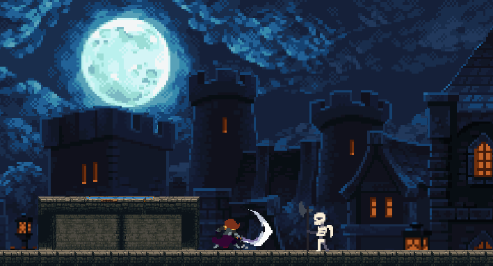

# Game Project

## Overview

I built this project as a fully playable game using **Unity** and **C#**. It’s a great example of how to design, code, and polish a game from scratch. Through this project, I gained hands-on experience in game development, programming, and Unity workflows. The project serves as both a personal achievement and a portfolio piece to showcase my skills in game creation.

## What I’ve Done

### 1. **Created a Playable Game**

- I developed a **fully playable game** that I can now showcase in my portfolio or enjoy as a personal project.
- The game was built from the ground up, starting from the initial concept, through prototype stages, to a completed game with polished mechanics and a user-friendly experience.

### 2. **C# Programming**

- Throughout the project, I used **C#**, a versatile programming language, to implement all game mechanics, UI elements, and player interactions.
- I focused on writing **clean, efficient code**, ensuring that it was both functional and maintainable.

### 3. **Problem-Solving and Debugging**

- I encountered and solved various **game-specific challenges**, such as building player controls, implementing AI behaviors, and designing level progression.
- Through testing and debugging, I refined the game mechanics and optimized performance to enhance the overall gameplay experience.

### 4. **Object-Oriented Programming (OOP) in Practice**

- I utilized **Unity’s Component-based architecture** and applied **Object-Oriented Programming (OOP)** principles such as **inheritance**, **polymorphism**, and **encapsulation** to structure the game’s code.
- This approach allowed me to create **modular and reusable components**, making the game codebase cleaner and easier to maintain.

### 5. **Game Design**

- I applied **core game design principles**, including **level design**, **player progression**, and **gameplay balance**.
- My goal was to craft mechanics that would engage players, while balancing fun, challenge, and difficulty throughout the game.

### 6. **Scalable Game Architecture**

- I focused on designing a **scalable game architecture** by incorporating **software design patterns** like **Singleton**, **Factory**, **Observer**, and **State**.
- I ensured the game’s codebase could grow easily by making the game logic modular, using **event-driven architecture** and maintaining **separation of concerns**.
